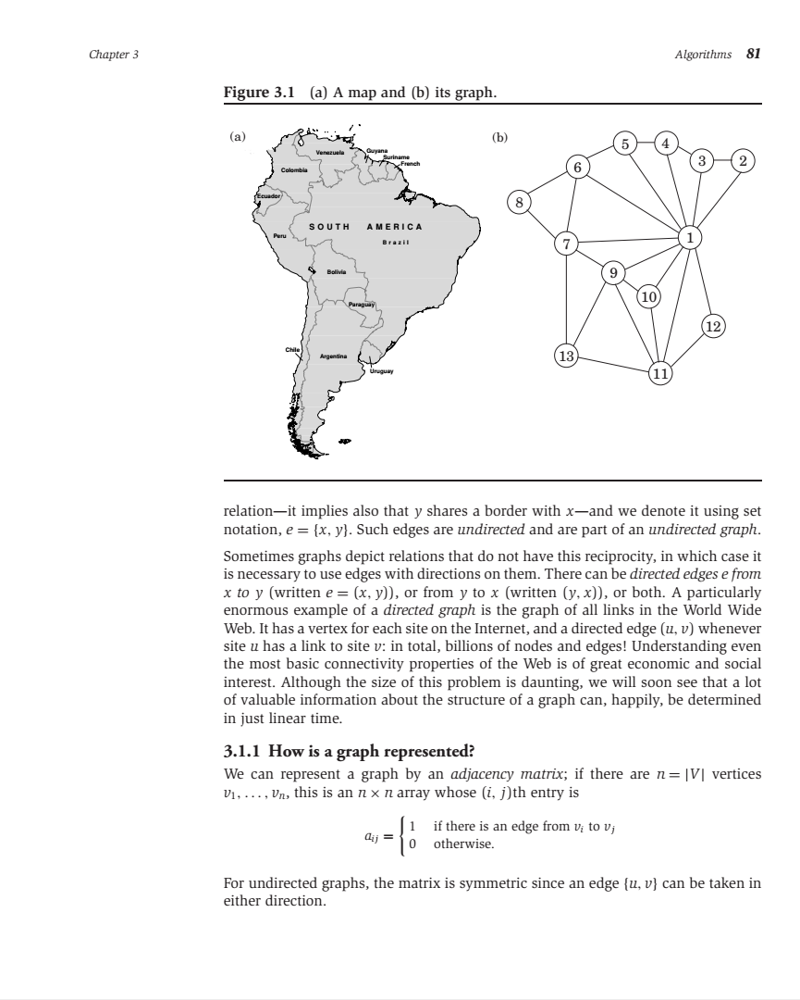

# World Borders Quiz

This game tests the player's knowledge of the world's borders through procedurally generated multiple-choice questions.

For example -

* Which of these does not border Belize?

    * A. Mexico
    * B. Guatemala
    * C. Honduras

(The answer is Honduras.)

Try it [here](http://danielmoore.us/borders-quiz)!

## Installation

Just install [Git](https://git-scm.com/) and [Node.js](https://nodejs.org/en/), then open your command prompt and run -

```
git clone https://github.com/denialromeo/borders-quiz
cd borders-quiz
npm install
npm start
```

Now you can play the game at [http://localhost:8080](http://localhost:8080)!

## Development Guide

Adding a quiz is simple. Just add relevant entries to [borders.json](/borders-quiz/build-question/borders.json) and [quiz-modes.json](/borders-quiz/game/quiz-modes.json). You can also play with some settings in [game-settings.json](/borders-quiz/game/game-settings.json) (e.g. more precise maps, prepending "the", giving tougher answer choices than the default algorithm).

However, you must observe these rules or the game will break -

* The top-level labels of [borders.json](/borders-quiz/build-question/borders.json) and [quiz-modes.json](/borders-quiz/game/quiz-modes.json) *must* match.
* All entries in [borders.json](/borders-quiz/build-question/borders.json) *must* be unique. Add trailing underscores to avoid conflicts with entries in existing quiz modes.
* If a territory is on an island and borders every other territory on that island (e.g. Haiti and the Dominican Republic), you *must* manually provide alternative answer choices in [question-settings.json](/borders-quiz/build-question/question-settings.json).

(Running `npm test` will alert you to game-breaking data.)

You can find U.S. fusion table data [here](https://support.google.com/fusiontables/answer/1182141?hl=en), official U.S. Census Bureau KML data [here](https://www.census.gov/geo/maps-data/data/tiger-kml.html), world state/province level data [here](https://fusiontables.google.com/DataSource?docid=1uK6JhwbCLeJWmTmoWTIKFOmdZuTxhfeT_Gy05QXy), and world physical geography fusion table data [here](https://fusiontables.google.com/DataSource?classic=true&docid=1UGwYogqtxVPga_76rxpL38CO1U6tr2s6Z0wSaQ).

Note that you can also create custom quizzes by playing with the URL. Examples -

* [Countries that end with "stan"](http://danielmoore.us/borders-quiz?custom=stan$)
* [Country quiz excluding bodies of water](http://danielmoore.us/borders-quiz?custom=^(?!.*(Sea|Gulf|Bay|Strait|Lake|Channel|Ocean|Rio|Bight)\b))
* [Country quiz with two answer choices](http://danielmoore.us/borders-quiz?num-choices=2)
* [Countries in Africa](http://danielmoore.us/borders-quiz?start=Guinea&depth=100&exclude-paths-through=Egypt;Morocco)
* [Countries in Europe (including Russia and Turkey)](http://danielmoore.us/borders-quiz?start=North+Sea&depth=100&exclude-paths-through=Russia;Spain;Turkey&exclude=North+Sea)
* [U.S. states that don't contain the letters 'a' or 'e'](http://danielmoore.us/borders-quiz?usa-states&custom=^(?!.*[ae]))
* [Canada and neighboring U.S. states](http://danielmoore.us/borders-quiz?start=Canada_)
* [New York City boroughs](http://danielmoore.us/borders-quiz?new-york-counties&custom=Bronx|Manhattan|Queens|Brooklyn)
* [San Francisco Bay Area counties](http://danielmoore.us/borders-quiz?start=San+Francisco+Bay)
* [San Francisco Bay Area counties starting with map](http://danielmoore.us/borders-quiz?california-counties&start=San+Francisco+Bay&start-map=San+Francisco+Bay)
* [Southern California counties](http://danielmoore.us/borders-quiz?california-counties&custom=Imperial|Los+Angeles|Kern|Orange|Riverside|San+Bernardino|San+Diego|San+Luis+Obispo|Santa+Barbara|Ventura)
* [India's Punjab and Pakistan's Punjab](http://danielmoore.us/borders-quiz?india-states&pakistan-provinces&custom=Punjab)

(Github has encoded the above URL's for security. To see them in a more readable form, check the [raw version](https://raw.githubusercontent.com/denialromeo/borders-quiz/master/README.md) of this README.)

## Known Bugs

* Territory names in more recent quiz modes aren't properly abbreviated on mobile.

* The game doesn't work on Microsoft Edge. This is because Edge doesn't yet support the HTML5 iframe `srcdoc` attribute. (Bug report [here](https://developer.microsoft.com/en-us/microsoft-edge/platform/issues/12375527/).) Microsoft will fix it sooner or later.

## Inspiration

The idea for this project was taken from this beautiful diagram in [*Algorithms*](https://www.amazon.com/Algorithms-Sanjoy-Dasgupta-ebook/dp/B006Z0QR3I/ref=sr_1_1_twi_kin_1?ie=UTF8&qid=1534812555&sr=8-1) by Dasgupta, Papadimitriou, and Vazirani.

